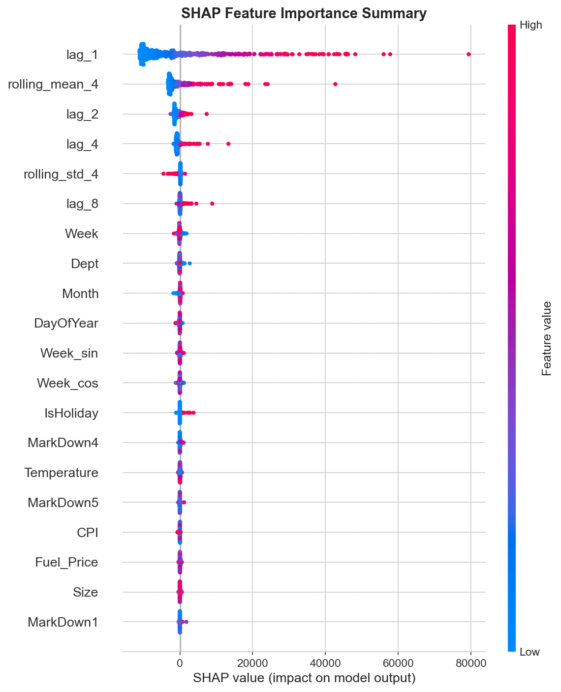
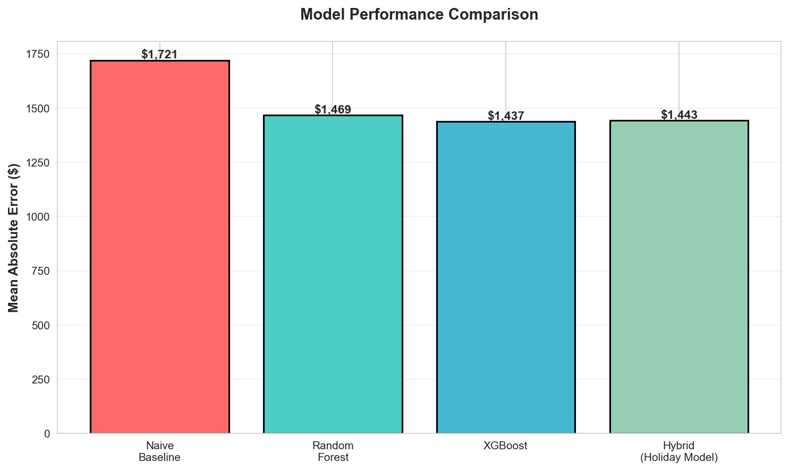
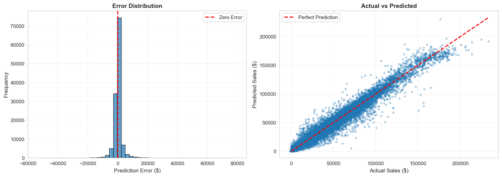

# Walmart Sales Forecasting

**Predicting weekly retail demand with XGBoost + Explainable AI · Live interactive dashboard**

👉 **[Live Demo](https://walmart-demand-forecasting.onrender.com/)** ← replace with your Render URL

---

## 🎯 Problem

Walmart needs accurate sales forecasts to:
- Avoid stockouts (lost revenue)
- Prevent overstock (wasted capital)
- Plan inventory across 45 stores, 81 departments
- Meet investor expectations (stock price impact)

**Bad forecasts = millions in losses.**

---

## 📊 Solution

Built a machine learning forecasting system that predicts weekly sales **16.5% better** than baseline — deployed as an interactive Streamlit dashboard.

| Model | MAE | Improvement |
|---|---|---|
| Naive Baseline | $1,721 | - |
| Random Forest | $1,469 | 14.6% |
| **XGBoost** | **$1,437** | **16.5%** ✅ |
| **Hybrid (Holiday Model)** | **$1,443** | **16.1%** ✅ |

---

## 🚀 Live Dashboard Features

- 📈 **Store & Department Forecast** — select any of 45 stores and 81 departments, see actual vs predicted sales chart with holiday markers
- 📊 **Model Performance** — overall MAE, accuracy, holiday vs non-holiday breakdown, top 10 hardest-to-forecast store-dept combos
- 🧠 **Feature Importance** — interactive SHAP importance chart with adjustable top-N features

---

## 🔍 Key Findings

**1. Lag features dominate (76% importance)**
- Last week's sales predict this week better than any external factor
- Weather, economy, promotions = minimal impact

**2. Department 92 is a problem child**
- Appears in 5 of top 10 hardest-to-forecast combinations
- Average error: $10,000+/week
- **Recommendation:** Increase safety stock 25-30%

**3. Holidays are 21% harder to forecast**
- Holiday MAE: $1,751 vs Non-Holiday: $1,422
- Extreme spikes (Thanksgiving +60%, Black Friday +80%)
- **Recommendation:** Accept higher buffer stock during holidays

**4. High-error stores identified**
- Stores 20, 14, 13 account for 35% of total error
- **Recommendation:** Build store-specific models

---

## 💼 Business Impact

**Potential value:** ~$7M annual savings across all stores  
*(Based on reduced stockouts + overstock costs)*

**Immediate actions:**
1. Deploy XGBoost for weekly forecasting
2. Increase safety stock for Dept 92 combinations
3. Add daily inventory reviews for top-error stores

---

## 🛠️ How It Works

### Data
- 421,570 weekly observations (2010-2012)
- 45 stores, 81 departments
- Features: Sales history, promotions, store attributes, economic indicators

### Feature Engineering
- **Lag features:** `lag_1`, `lag_2`, `lag_4`, `lag_8`
- **Rolling stats:** 4-week moving average, std dev
- **Time encoding:** Cyclical week/month encoding
- **Promotions:** Total markdown, promo flag

### Models
- XGBoost (300 trees, learning rate 0.05)
- Hybrid holiday model — separate XGBoost trained on holiday weeks only
- SHAP TreeExplainer for feature importance

---

## 📈 Visualizations

### SHAP Feature Importance


### Model Comparison


### Error Analysis


---

## 🗂️ Project Structure

```
walmart-demand-forecasting/
├── app.py                 # Streamlit dashboard
├── train_model.py         # Training script — saves models + val_results
├── notebooks/             # Original analysis notebook
├── models/                # Saved .pkl files (XGBoost + SHAP explainer)
├── data/raw/              # Kaggle CSVs (not committed)
├── images/                # Visualizations
├── val_results.csv        # Validation predictions used by the app
├── shap_importance.csv    # SHAP feature importance scores
├── requirements.txt
├── runtime.txt
└── README.md
```

---

## ⚙️ Run Locally

```bash
# 1. Clone the repo
git clone https://github.com/hasitha165616-pixel/walmart-demand-forecasting.git
cd walmart-demand-forecasting

# 2. Create virtual environment
python -m venv venv
venv\Scripts\activate  # Windows
source venv/bin/activate  # Mac/Linux

# 3. Install dependencies
pip install -r requirements.txt

# 4. Download data from Kaggle and place in data/raw/
# https://www.kaggle.com/datasets/aslanahmedov/walmart-sales-forecast
# Files needed: train.csv, test.csv, features.csv, stores.csv

# 5. Train the model
python train_model.py

# 6. Run the app
streamlit run app.py
```

---

## 🎓 Tech Stack

| Component | Technology |
|---|---|
| Frontend | Streamlit |
| Models | XGBoost, Random Forest |
| Explainability | SHAP TreeExplainer |
| Data processing | pandas, numpy |
| Visualisation | matplotlib |
| Deployment | Render |

---

## 🔮 Future Improvements

- [ ] Add prediction intervals (uncertainty quantification)
- [ ] Department-specific models for Dept 92
- [ ] External data: weather, local events
- [ ] Real-time data pipeline

---

## 🙏 Data Source

[Walmart Recruiting - Store Sales Forecasting (Kaggle)](https://www.kaggle.com/datasets/aslanahmedov/walmart-sales-forecast)

---

⭐ Star this repo if you found it helpful!
